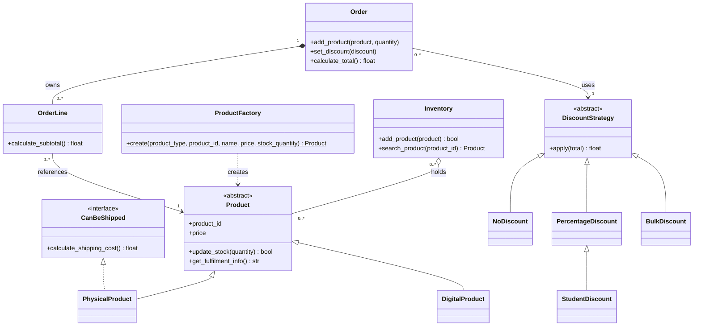

# Lab 9 class diagram

```mermaid
classDiagram
    class Product {
        <<abstract>>
        +product_id
        +price
        +update_stock(quantity) bool
        +get_fulfilment_info() str
    }
    class CanBeShipped {
        <<interface>>
        +calculate_shipping_cost() float
    }
    class Inventory {
        +add_product(product) bool
        +search_product(product_id) Product
    }
    class ProductFactory {
        +create(product_type, product_id, name, price, stock_quantity) Product$
    }
    class Order {
        +add_product(product, quantity)
        +set_discount(discount)
        +calculate_total() float
    }
    class OrderLine {
        +calculate_subtotal() float
    }
    class DiscountStrategy {
        <<abstract>>
        +apply(total) float
    }
    Product <|-- PhysicalProduct
    Product <|-- DigitalProduct
    CanBeShipped <|.. PhysicalProduct
    Inventory "0..*" o-- "0..*" Product : holds
    ProductFactory ..> Product : creates
    Order "1" *-- "0..*" OrderLine : owns
    OrderLine "0..*" --> "1" Product : references
    Order "0..*" --> "1" DiscountStrategy : uses
    DiscountStrategy <|-- NoDiscount
    DiscountStrategy <|-- PercentageDiscount
    DiscountStrategy <|-- BulkDiscount
    PercentageDiscount <|-- StudentDiscount
```

Each order uses one discount strategy at a time. A strategy can be shared by any number of orders. The factory creates products and returns them to the caller.
